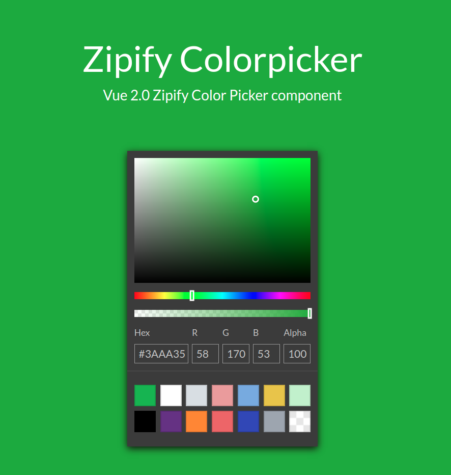

# Zipify ColorPicker

Vue 2.0 Zipify Color Picker component



## Installation

### NPM
```bash
$ npm install zipify-colorpicker
```

### CommonJS
```js
var ZipifyColorpicker = require('zipify-colorpicker/src/ZipifyColorpicker.vue');

new Vue({
  components: {
    'ZipifyColorpicker': ZipifyColorpicker
  }
})
```

### ES6
```js
import { ZipifyColorpicker } from 'zipify-colorpicker'

new Vue({
  components: {
    ZipifyColorpicker
  }
})
```

### Browser globals
The `dist` folder contains `zipify-colorpicker.js` and `zipify-colorpicker.min.js` with all components exported in the <code>window.ZipifyColorpicker</code> object. These bundles are also available on NPM packages.

```html
<script src="path/to/vue.js"></script>
<script src="path/to/zipify-colorpiker.min.js"></script>
<script>
  var ZipifyColorpicker = ZipifyColorpicker.ZipifyColorpicker
</script>
```

## Local setup

```
npm install
npm run dev
```

## Usage

```js

var color = '#0f0';      //hex3
// or
var color = '#0f08';     //hex4
// or
var color = '#00ff00';   //hex6
// or
var color = '#00ff0088'; //hex8
// or
var color = 'rgba(0, 255, 0)'; //rgb
// or
var color = 'rgba(0, 255, 0, 0.53)'; //rgba, alpha - 0-1
// or
var color = 'rgba(0, 255, 0, 53)'; //rgba, alpha - 0-100
// or
var color = 'rgba(0, 255, 0, 53%)'; //rgba, alpha - 0-100%
// or
var color = 'red'; //color names
// or
var color = 'hsl(39, 100%, 50%)'; //hsl, s and l in %
// or
var color = 'hsl(39, 1, 0.5)'; //hsl, s and l - 0-1
// or
var color = 'hsla(39, 100%, 50%, 50%)'; //hsl,  s, l and alpha in %
// or
var color = 'hsla(39, 1, 0.5, 0.5)'; //hsl,  s, l and alpha - 0-1
// or
var color = 'hsv(39, 100%, 50%)'; //hsv, s and v in %
// or
var color = 'hsv(39, 1, 0.5)'; //hsv, s and v - 0-1
// or
var color = 'hsva(39, 100%, 50%, 50%)'; //hsva,  s, v and alpha in %
// or
var color = 'hsva(39, 1, 0.5, 0.5)'; //hsva,  s, v and alpha - 0-1

new Vue({
  el: '#app',
  components: {
    ZipifyColorpicker,
  },
  data () {
    return {
      color
    }
  }
})

```

```html
<!-- suppose you have the data 'color' in your component -->
<ZipifyColorpicker v-model="color" />
```

OR

```html
<ZipifyColorpicker :value="color" @input="updateValue" />
```

In some cases you can give the component a predefined set of colors with the property `presetColors` by simply passing it an array with the color values as strings in any css compatible format.

```html
<ZipifyColorpicker
  @input="updateValue"
  :value="color"
  :preset-colors="[
    '#f00', '#00ff00', '#00ff0055', 'rgb(201, 76, 76)', 'rgba(0,0,255,1)', 'hsl(89, 43%, 51%)', 'hsla(89, 43%, 51%, 0.6)'
  ]"
/>
```

## License
zipify-colorpicker is licensed under [The MIT License](LICENSE).
