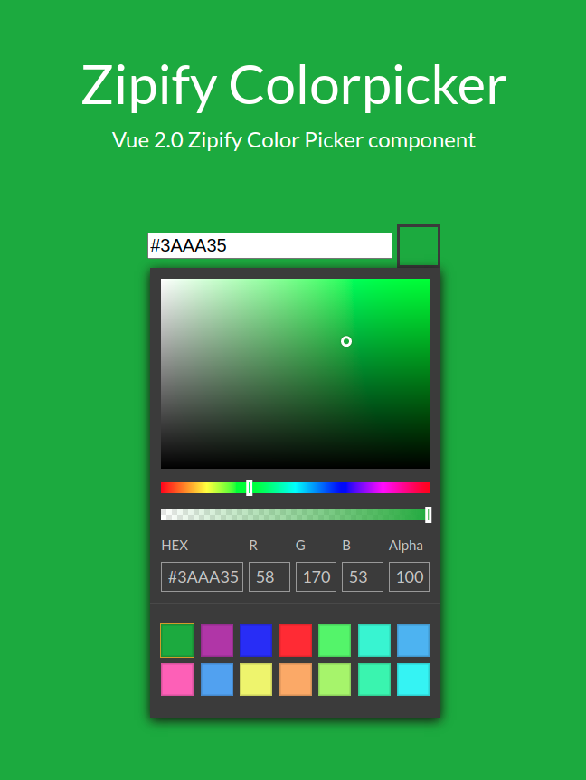

# Zipify ColorPicker

Vue 2.0 Zipify Color Picker component



## Installation

### NPM
```bash
$ npm install zipify-colorpicker
```

### Yarn
```bash
$ yarn add zipify-colorpicker
```

### CommonJS
```js
const { ZipifyColorPicker } = require('zipify-colorpicker');

new Vue({
  components: {
    ZipifyColorPicker
  }
})
```

### ES6
```js
import { ZipifyColorPicker } from 'zipify-colorpicker'

new Vue({
  components: {
    ZipifyColorPicker
  }
})
```

### Browser globals
The `dist` folder contains `zipify-colorpicker.js` and `zipify-colorpicker.min.js` with all components exported in the <code>window.ZipifyColorPicker</code> object. These bundles are also available on NPM/Yarn packages.

```html
<script src="path/to/vue.js"></script>
<script src="path/to/zipify-colorpicker.min.js"></script>
<script>
  const { ZipifyColorPicker } = window.ZipifyColorPicker
</script>
```

## Local setup

```
npm install
npm run dev
```

## Usage

```js

var color = '#0f0';      //hex3
// or
var color = '#0f08';     //hex4
// or
var color = '#00ff00';   //hex6
// or
var color = '#00ff0088'; //hex8
// or
var color = 'rgba(0, 255, 0)'; //rgb
// or
var color = 'rgba(0, 255, 0, 0.53)'; //rgba, alpha - 0-1
// or
var color = 'rgba(0, 255, 0, 53)'; //rgba, alpha - 0-100
// or
var color = 'rgba(0, 255, 0, 53%)'; //rgba, alpha - 0-100%
// or
var color = 'red'; //color names
// or
var color = 'hsl(39, 100%, 50%)'; //hsl, s and l in %
// or
var color = 'hsl(39, 1, 0.5)'; //hsl, s and l - 0-1
// or
var color = 'hsla(39, 100%, 50%, 50%)'; //hsl,  s, l and alpha in %
// or
var color = 'hsla(39, 1, 0.5, 0.5)'; //hsl,  s, l and alpha - 0-1
// or
var color = 'hsv(39, 100%, 50%)'; //hsv, s and v in %
// or
var color = 'hsv(39, 1, 0.5)'; //hsv, s and v - 0-1
// or
var color = 'hsva(39, 100%, 50%, 50%)'; //hsva,  s, v and alpha in %
// or
var color = 'hsva(39, 1, 0.5, 0.5)'; //hsva,  s, v and alpha - 0-1

new Vue({
  el: '#app',
  components: {
    ZipifyColorPicker,
  },
  data () {
    return {
      color,
      paletteKey,
      presetColors,
      type,
      maxPaletteColors,
      durationEnter,
      durationLeave,
      placement,
      isOverTop
    }
  }
})

```

```html
<!-- suppose you have the data 'color' in your component -->
<ZipifyColorPicker
  v-model="color"
  :palette-key="paletteKey"
  :type="rgba"
  :preset-colors="presetColors"
  :max-palette-colors="14"
  :duration-enter="150"
  :duration-leave="100"
  :placement="bottom-end"
  :is-over-top="isOverTop"
  @input="updateValue"
>
  <template #activator="{ toggle, open }">
    <input type="text" v-model.lazy="color">
    <button type="button" :disabled="disabled" :style="bgc" class="zpc-color-preview" @click="toggle($event.target)" />
  </template>
</ZipifyColorPicker>
```

In some cases you can give the component a predefined palette with the property `presetColors` by simply passing it an array with the color values as strings in any css compatible format or you can set property `paletteKey`(localStorage key) and the palette will set from localStorage and you can limit the number of colors in showing palette.

## License
zipify-colorpicker is licensed under [The MIT License](LICENSE).
